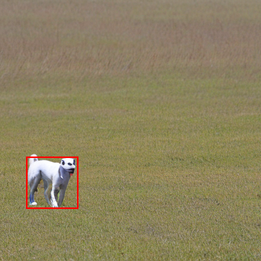

# IGLIGEN-XL: Improved Implementation for Training GLIGEN XL (Open-Set Grounded Text-to-Image Generation)
This project aims to support a SDXL version of GLIGEN adapters, with huggingface-style pipeline. The project is part of the effort in creating [InteractDiffusion XL](https://jiuntian.github.io/interactdiffusion). You can use/download pretrained GLIGEN adapters [here](#pretrained-gligen-xl-adapters).

## Motivation
[IGLIGEN](https://github.com/TonyLianLong/igligen) reproduces GLIGEN on diffusers frameworks and made the training procedure easier to be replicate. They have released the code and pretrained weights for SD v1.4/v1.5, SD v2.0/v2.1, but the support for SDXL is still awaited with great anticipation. This repo open source the pretrained weight of GLIGEN adapter for SDXL, together with the diffusers pipeline and training code. We thank the author of GLIGEN and IGLIGEN on their work.

## Examples
### IGLIGEN-XL on SDXL for box-controlled text-to-image generation
Condition for the examples:
Prompt: An image of grassland with a dog."

GLIGEN phrases: `["a dog"]`

GLIGEN boxes: `[[0.1, 0.6, 0.3, 0.8]]`

| Baseline (at beginning of training) | IGLIGEN-XL 512x512 (at end of training) | IGLIGEN-XL 1024x1024 |
| ------ | -------- | -------- | 
|  |  |  |


## Pretrained GLIGEN-XL adapters
### Text-to-image generation
The pretrained adapters for text-to-image generation on SDXL can be found here: [https://huggingface.co/jiuntian/gligen-xl-1024](https://huggingface.co/jiuntian/??). The models trained with this repo is requires the pipeline for inference (`StableDiffusionXLGLIGENPipeline`), provided in `pipeline_gligen_sdxl.py` for SDXL.

<details>
  <summary>An example that uses SDXL + GLIGEN.</summary>

Tested with `diffusers==0.30.1`.

```python
import torch
from diffusers import DiffusionPipeline

pipeline = DiffusionPipeline.from_pretrained(
    "jiuntian/gligen-xl-1024", trust_remote_code=True, torch_dtype=torch.float16
).to("cuda")

prompt = "An image of grassland with a dog."

# Image generation with GLIGEN
images = pipeline(
    prompt,
    num_inference_steps=50,
    height=1024, width=1024,
    gligen_scheduled_sampling_beta=0.4,
    gligen_boxes=[[0.1, 0.6, 0.3, 0.8]],
    gligen_phrases=["a dog"],
    num_images_per_prompt=1,
    output_type="pt"
).images


for image in images:
    display(image)
```
</details>

## Dataset Download and Preprocessing
**Note: we have preprocessed the dataset and uploaded them to huggingface. See [Download Preprocessed Dataset](#download-preprocessed-dataset) for details. You only need to download the raw dataset if you want to preprocess them on your own.**

[GLIGEN](https://github.com/gligen/GLIGEN) uses a mix of multiple datasets in training, with text/image embeddings coded in the tsv files. The preprocessing code (how to turn a dataset into the tsv files) is not given, which makes it hard to adapt to custom datasets. The text embeddings are different for different diffusion models, which make the stored embeddings in the tsv files not useful. The dataset is thus not efficiently stored.

We follow IGLIGEN. Similar to PixArt-alpha, we use [SA-1B](https://ai.meta.com/datasets/segment-anything/) dataset for training. Note that SA-1B dataset actually has ~11M images. If you use the code/weights from this project, you agree to adhere to the [terms and conditions](https://ai.meta.com/datasets/segment-anything-downloads/) of SA-1B.

We provide complete preprocessing scripts, so you can easily switch to other datasets on your own.

### Download Raw Dataset
**Note: See [Download Preprocessed Dataset](#download-preprocessed-dataset) for preprocessed dataset.**

Please download the tar files from the [SA-1B website](https://ai.meta.com/datasets/segment-anything-downloads/). Captions of images of SA-1B are from LLaVA, generated by PixArt-alpha team, you can download them here [SAM-LLaVA-captions](https://huggingface.co/datasets/PixArt-alpha/SAM-LLaVA-Captions10M).

### Dataset Preprocessing
We use the [boxes metadata](https://huggingface.co/datasets/longlian/sa-1b_boxes) from IGLIGEN preprocessed dataset, however, for SDXL, it requires extra image's original size metadata as conditions, thus, we also preprocess this part and then merge with IGLIGEN's boxes metadata. Particularly, the code to extract the original size metadata is at `preprocess/extract_sdxl_ori_size.py` and the script `ori_size.sh` run this parallely.

We also preprocess the dataset into latents so that it does not have to be encoded again in training. This also saves a lot of space. Note that you need to preprocess the dataset for the desired resolution (i.e., 512x512 and 1024x1024), since we train on two resolutions. The [script](preprocess/encode_latents.py) is in `preprocessing` directory.

You can use `xargs` command to parallelize preprocessing:
```shell
ls -1 /path_to_sa-1b/sa_000{000..999}.tar|sort|xargs -P 2 -I {} python encode_latents.py {}
```

### Download Preprocessed Dataset
The dataset is preprocessed and stored in latent format. The preprocessed dataset is much smaller than the original dataset, thanks to the efficient latent space. As an example, SA-1B tar files are typically around 11GB. However, after preprocessing, each npy file corresponding to a tar file is around 368MB and 1.47GB for 512x512 and 1024x1024. Only the preprocessed dataset is used in training.

| Preprocessed SA-1B | HuggingFace Link |
| -------- | ------- |
| Latents (512x512, for SDXL)  | https://huggingface.co/datasets/jiuntian/sa1b-sdxl-latents-512 |
| Latents (1024x1024, for SDXL) | https://huggingface.co/datasets/jiuntian/sa1b-sdxl-latents-1024 |
| Metadata (Bounding Boxes and Original Size)    | https://huggingface.co/datasets/jiuntian/sa-1b_boxes_sdxl |

Please put the latents in `data/sdxl-512/latents`, and bounding boxes in `data/sdxl-512/boxes`. Same for `data/sdxl-1024`.

## Training
We training on 8 A100 GPUs with SDXL, specifically:
1. 500k steps on 512x512 resolution, this take ≈6 days.
2. 100k steps on 1024x1024 resolution, this take ≈3.14 days

The training script we used, by sequence, are `train_sdxl.sh`, `train_sdxl_resume.sh`, and `train_sdxl_resume_1024.sh`.

You can edit the training script to use more/fewer GPUs and update the hyperparameters.

## Citation
The authors of this repo (IGLIGEN-XL) are not affiliated with the authors of GLIGEN and IGLIGEN. Since IGLIGEN-XL is based on GLIGEN and IGLIGEN, if you use the IGLIGEN-XL code or adapters, please kindly consider citing the original GLIGEN and IGLIGEN paper:
```
@article{li2023gligen,
  title={GLIGEN: Open-Set Grounded Text-to-Image Generation},
  author={Li, Yuheng and Liu, Haotian and Wu, Qingyang and Mu, Fangzhou and Yang, Jianwei and Gao, Jianfeng and Li, Chunyuan and Lee, Yong Jae},
  journal={CVPR},
  year={2023}
}
@article{lian2023llmgrounded,
  title={Llm-grounded diffusion: Enhancing prompt understanding of text-to-image diffusion models with large language models},
  author={Lian, Long and Li, Boyi and Yala, Adam and Darrell, Trevor},
  journal={arXiv preprint arXiv:2305.13655},
  year={2023}
}
```

The project is part of the effort in creating [InteractDiffusion XL](https://jiuntian.github.io/interactdiffusion/). 

Please kindly consider citing InteractDiffusion if you use IGLIGEN-XL code/trained weights.
```
@inproceedings{hoe2023interactdiffusion,
  title={InteractDiffusion: Interaction Control in Text-to-Image Diffusion Models}, 
  author={Jiun Tian Hoe and Xudong Jiang and Chee Seng Chan and Yap-Peng Tan and Weipeng Hu},
  year={2024},
  booktitle={Proceedings of the IEEE/CVF Conference on Computer Vision and Pattern Recognition (CVPR)},
}
```
